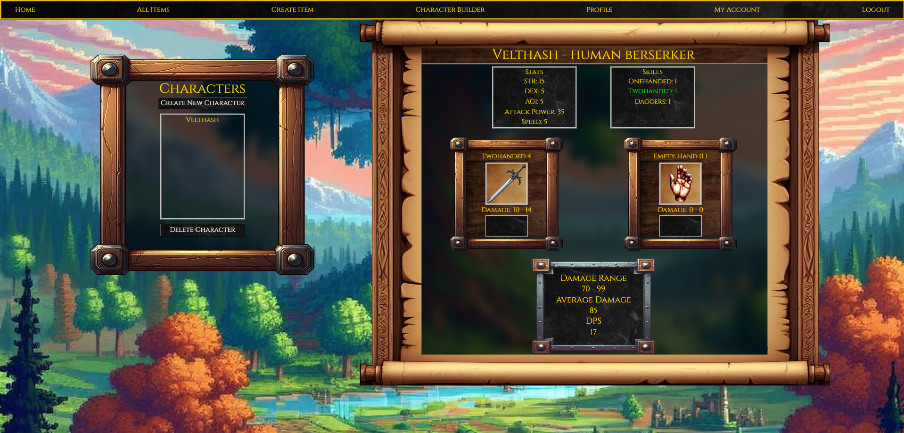

# Capstone: Galvadia Character Builder

A support application used to create, store, and test weapons for my game, Galvadia. It's primary use is to help me keep track of every weapon and to adjust weapon damage in-game by testing them in the damage simulator, though, a regular user could find this application useful if they have a character that they want to test weapons out with.

## Table of Contents
- [Installation](#installation)
- [Usage](#usage)
- [Features](#features)
- [Technologies Used](#technologies-used)

## Installation

To run this project locally:
1. Clone the repository
2. Cd into the capstone directory
3. Run `npm install` to install dependencies
4. To start the json-server, enter the command `json-server --watch -p 8088 database.json`. Be sure you are in the directory with the database.json file when running this command
5. To start the Vite development server, cd into the src folder and enter the command `npm run dev`
6. Ctrl + click (for Windows) or copy the localhost server link from the terminal and paste into your browser (default url is http://localhost:5173/)
7. Good to go!

## Features / How To Use

### Main Views:

1. **All Items**

   - You can view all created items on this page
   - Clicking on an item will take you to its details view

2. **Item Details**

   - An item's details view will give you a closer view of the item
   - This view will also allow you to edit or delete the item
     
3. **Create Item**

   - You can create an item on this page by assigning it whatever values you'd like. To select a picture, click the image box at the top to open the image selector
     
4. **Character Builder**

   - In this view, you can test any weapon, but you need to already have a character created in the Profile view.
   - Every weapon can be dual wielded except for two handed weapons. To equip a weapon, click the appropriate button. You can also remove any weapon by clicking the appropriate button. Equipping a two handed weapon will automatically unequip your righthand weapon, and the two handed weapon will be shown as equipped in the left hand. Your weapon skill will automatically change depending on the type of weapon you choose: Onehanded weapon = onehanded weapon skill, twohanded weapon = twohanded weapon skill, etc.
   - **Attack Power**: The main number used in calculating damage value. Str, Dex, and Agi all factor into the damage value, but differ depending on your weapon skill being used (highlighted in green).
   - **Swing Speed**: This reflects your actual swing time in-game. It doesn't play a factor in your raw damage value, but it does affect your DPS.
   - **Weapon Skill**: Your weapon skill is automatically chosen based on the weapon type you have equipped (it's impossible to use a mix of weapon skills and weapon types, i.e., wielding a dagger will ALWAYS utilize your Daggers skill, wielding a onehanded weapon will ALWAYS utilize your onehanded weapon skill, etc).
   - **Save**: You can save your character's weapon configuration and stat adjustments. When you go back to the profile view, you will see the adjusted changes.
     
5. **Profile**

   - This is where you can create a character to reflect your in-game character in order to get an accurate representation of your damage output when testing weapons in the Character Builder view. You will also see a clean view of your selected character's stats, and you can also create new characters and delete existing ones.

